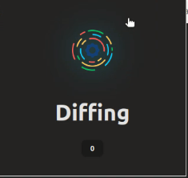
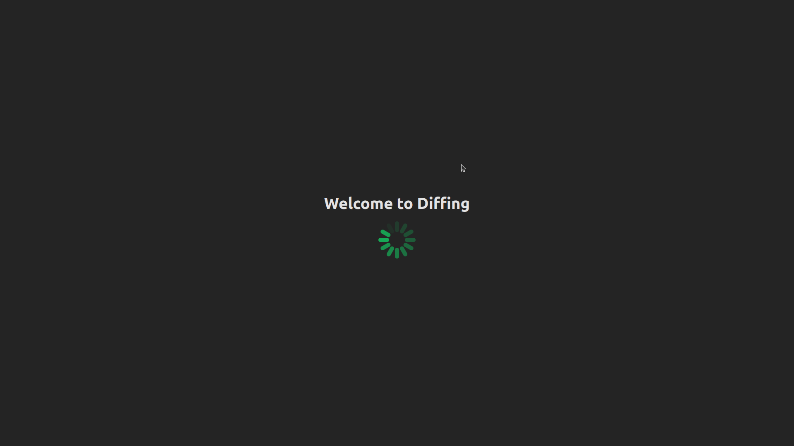
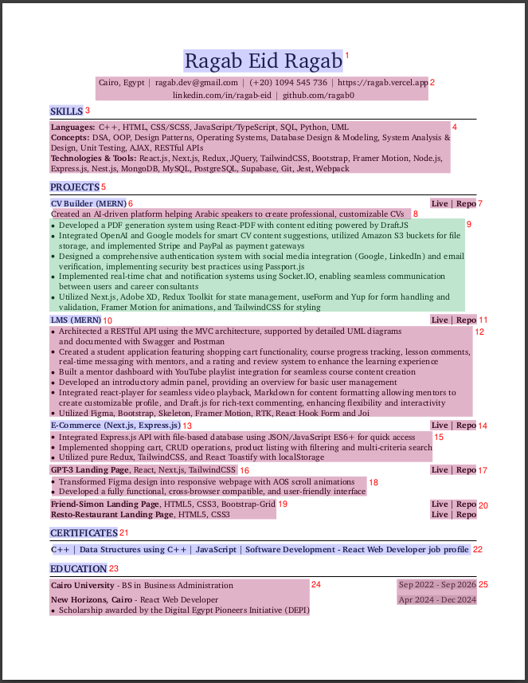
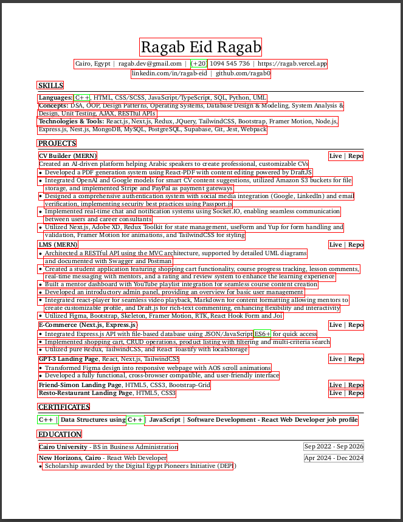

# Diffing

A sophisticated chrome extension and PDF parser that parses PDF documents and generates classified documents based and well-structured markdown format

## 🚀 Features

- PDF content parsing and extraction
- Intelligent content classification
- Markdown format generation
- REST API built with FastAPI
- Secure tunneling via Ngrok
- Collaborative model development environment using Google Colab

## 🛠️ Technology Stack

- **Frontend**: CSS, JavaScript, React, React-PDF
- **Backend**: Python, FastAPI, Ngrok
- **Model Development Environment**: Google Colab

<!-- demo for the extension ui in imgs -->

## 🎉 Demo

## 📖 Example Usage

1. generated markdown:
   [example1_markdown](./public/assets/example1/cv_markdown.md)
2. generated content list:
   [example1_content_list](./public/assets/example1/cv_content_list.json)
3. classified document layout:
   
4. classified document spans:
   
